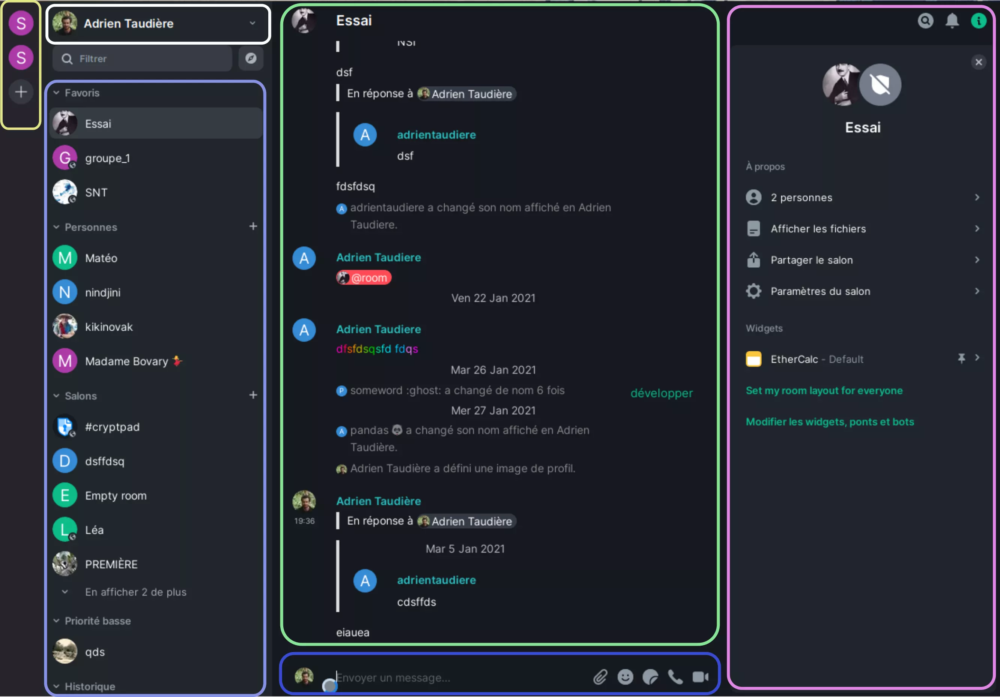

# Element.io (tchat, alternative à Slack)

[<i class="fa fa-external-link" aria-hidden="true"></i> Info sur Element](https://app.element.io/)
[<i class="fa fa-external-link" aria-hidden="true"></i> Appli web](https://element.io/get-started)

Synthèse</i>

Pour utiliser l'application de communication `Element`, il faut s'**inscrire** [<i class="fa fa-question-circle-o" aria-hidden="true"></i>](#s39inscrire) sur le [site web](https://app.element.io/) de l'application en prenant bien soin de conserver sa **clé de sécurité**. Après vous êtes familiarisé avec les concepts de salon de discussion [<i class="fa fa-question-circle-o" aria-hidden="true"></i>](#le-concept-des-salons), de communauté [<i class="fa fa-question-circle-o" aria-hidden="true"></i>](#le-concept-des-communautés) et de fil de discussion [<i class="fa fa-question-circle-o" aria-hidden="true"></i>](#le-concept-des-fils-de-discussion), il vous reste à modifier vos **paramètres de notification** grâce aux mots clés. Vous serez ensuite **invité** à une (ou des) communauté(s) par les administrateurs informatiques de Scholae. Les salons auxquels vous accéderez alors dépendent de ces communautés (détails des salons et des communautés [ici](le-concept-des-salons)).

## Introduction

`Element` est une application permettant de communiquer de façon efficace et sécurisé. Cette application est une alternative à Slack très complète. Dans une même interface on peut discuter avec plusieurs groupes, partager des documents, écrire sur des documents communs et utiliser également le logiciel Jitsi pour faire des appels en visioconférence.

Un des nombreux avantages de Element c'est qu'on peut l'utiliser directement dans un navigateur [web](https://app.element.io/) mais qu'il existe aussi des clients pour [Android](https://play.google.com/store/apps/details?id=im.vector.app), [Iphone](https://apps.apple.com/app/vector/id1083446067), [Mac OS](https://packages.riot.im/desktop/install/macos/Element.dmg), [Windows](https://packages.riot.im/desktop/install/win32/x64/Element%20Setup.exe), et bien sûr [Linux](https://element.io/get-started).

!> L'instance [BigBlueButton](/BBB.md) est à privilégier pour vos visioconférences longues. Pour des petits points, l'outil de visioconférence intégré à Element peut être utilisé.

## Premier pas avec Element

### S'inscrire 

Pour s'inscrire il faut se rendre sur l'[application web](https://app.element.io/) et de cliquer sur `Créer un compte`. Ensuite, il faut choisir un serveur, pour le moment nous allons utiliser le serveur **Matrix.org**. Peut être que plus tard nous migrerons vers notre propre serveur. Votre navigateur va sans doute vous demander un accès au stockage persistant des données. Il faut accepter pour qu'Element puisse stocker vos clés et messages sur votre ordinateur. Vous devait ensuite renseigner votre nom d'utilisateur, un mot de passe ainsi qu'un email. L'email n'est pas obligatoire mais fortement conseillé pour pouvoir redemander son mot de passe si besoin. Le nom d'utilisateur et l'email 
permettrons aux gens veulent communiquez avec vous de vous retrouver.

!> La prochaine étape est un peu délicate, concentrez-vous. Un des principaux avantages de Element est le chiffrement de bout en bout ([<i class="fa fa-wikipedia-w" aria-hidden="true"></i>](https://fr.wikipedia.org/wiki/Chiffrement_de_bout_en_bout)). Pour cela, chacun de nous a besoin de générer une clé de Sécurité (attention, c'est différent du mot de passe). 
Lors de votre première communication à l'application, Element permet de `générer une clé de sécurité`. Il faut que vous stockiez précieusement cette clé quelque part (par ex. avec un gestionnaire de mot de passe comme celui de [Firefox](https://www.mozilla.org/fr/firefox/lockwise/) ou [KeePassXC](https://keepassxc.org/)). Elle vous servira à retrouver l'historique de vos conversations si vous perdez vos comptes et à vous authentifier quand vous utiliserez un nouveau périphérique (c'est à dire un nouvel ordinateur ou smartphone).

?> Pour l'instant nous allons utiliser des salons non chiffrés. Le chiffrement des discussions rends assez complexes certaines fonctionnalités. Lors de la création d'un nouveau salon il faut bien cocher que l'on souhaite un salon non chiffrés. Les salons de discussions deux-à-deux sont toujours chiffrés.

### Un petit tour de l'interface

À droite (rectangle jaune), les **communautés** sont représentées par des badges qui vous permettent de filtrer les salons que vous regardez. Dans la colonne suivante votre nom d'utilisateur (rectangle blanc) permet, en cliquant dessus, d'ouvrir des options (mode sombres, paramètres…). Au dessous une barre de recherche permet de filtrer les salons. En cliquant sur la boussole (<i class="fa fa-compass" aria-hidden="true"></i>) on peut rechercher un salon public ou une personne. 

Encore en dessous (rectangle violet), vos salons sont classés selon plusieurs critères:
- Vos salons `favoris`. Pour mettre un salon en favoris il faut survoler le salon, cliquer sur <i class="fa fa-ellipsis-h" aria-hidden="true"></i> puis sur `favoris`.
- Les discussions directes (deux à deux) sont classés dans la catégorie `personnes`.
- Ensuite viennent les salons non classés favoris ni priorité basse.
- Puis les salons `priorité basse`.
- Enfin une section historique contiendra les salons que vous avez quitté ou qui ont été supprimé.

La colonne centrale (rectangle vert) est l'emplacement du texte de discussion. En bas de cette colonne se trouve la zone de texte (rectangle bleu) pour écrire un nouveau message ou partager des documents. 

Enfin, en cliquant sur le symbole <i class="fa fa-info-circle" aria-hidden="true"></i> en haut à droite on ouvre les options du salon à droite (rectangle rose) qui permettent notamment de voir les personnes qui participent au salon, de retrouver les fichier partagés ou encore de 
modifier les paramètres du salon. 

#### Le concept des communautés
 
Le protocole Matrix <i class="fa fa-matrix-org" aria-hidden="true"></i> qui est utilisé par l'application Element permet de communiquer avec de nombreuses personnes, que ce soit sur des sujets professionnels ou privés. Pour regrouper les salons selon des thématiques on peut utiliser des communautés. Une communauté sert donc à regrouper des utilisateurs (par ex. les membres du « cercle pédago » de Scholae) qui partagent des salons communs.

?> Les communautés à Scholae serait aux nombres de quatre initialement : la communauté **Équipe_éducative_Scho** qui comprend tous les adultes impliqués dans le bon fonctionnement de Scho, et une communauté par niveau (**Seconde_Scho**, **Première_Scho** et **Terminal_Scho**) qui incluent toutes les personnes concernées par le niveau (lycéens + équipe éducative). 

#### Le concept des salons

Dans les logiciels de communication le concept de **salons** (= canaux sous Slack) est central. Un salon regroupe un ensemble d'utilisateurs autour d'une thématique. Dans le cadre de Scholae, nous proposons l'organisation en Salon décrite ci dessous :

- **Seconde_Scho**
  - `Discussion générale` 
  - `Seconde` discussion générale 
  - `2nd-Matière 1` (par ex. «2nd-SNT») 
  - `2nd-Matière …`

- **Première_Scho**
  - `Première` discussion générale 
  - `1-Matière 1` (par ex. «1-NSI») 
  - `1-Matière …` 

- **Terminal_Scho**
  - `Terminal` discussion générale 
  - `T-Matière 1` (par ex. «T-NSI») 
  - `T-Matière …` 

- **Équipe_éducative_Scho** :
  - `Discussion_générale` 
  - `Calendrier`  
  - `Vie_de_l'élève` 
  - `À_propos_des_2nde` 
  - `À_propos_des_1ère` 
  - `À_propos_des_Term` 

#### Le concept des fils de discussion

Dans un salon, plusieurs discussions peuvent avoir lieu. Il est donc important de n'écrire un nouveau message que si le sujet est nouveau. Quand on veut réagir à un autre message il y répondre. Pour cela, en passant la souris sur le message on voit apparaître une liste de 3-4 boutons :
- Réagir (à l'aide d'un émoticône)
- Répondre
- Modifier le message (ce bouton n'apparaît que pour les messages dont on est l'auteur)
- Autres options

#### À qui je parle ? Qui à vu mes messages ?

Toutes les personnes qui sont inscrites dans le salon peuvent voir vos messages. La liste des personnes qui ont accès au salon se trouve dans la colonne de droite lorsque l'on clique sur l'icone  <i class="fa fa-info-circle" aria-hidden="true"></i>. 

À côté de chaque message, vous avez également une liste de badge qui indique qui a vu vos messages.

#### Comment j'écrit du texte ?

Vous pouvez utilisez le format [markdown](https://daringfireball.net/projects/markdown/) dans vos messages. C'est très simple, par ex. pour mettre un mot en gras on utilise entoure un mot avec deux étoiles. Pour indiquer un titre de rang 2 on utilise deux # devant le titre. Pour faire un lien hypertexte on met le texte du lien entre crochet puis l'adresse du lien entre parenthèse. Vous pouvez jouer avec ce langage sur le site [Dillinger](https://dillinger.io/).

Par ailleurs, quand vous tapez sur la touche `entrée`, vous envoyez le message. Pour passer à la ligne il faut tapez sur la touche `entrée` tout en maintenant la touche `maj` enfoncée.

## Les paramètres importants

Pour modifier vos paramètres il faut cliquer sur l'icône <i class="fa fa-chevron-down" aria-hidden="true"></i> à droite de votre nom puis sur <i class="fa fa-cog" aria-hidden="true"></i>  `Tous les paramètres `. Les paramètres généraux et d'apparence sont assez classiques.

### Les paramètres de notification

Les notifications jouent un rôle très important dans Element. Vous pouvez choisir pour un grand nombre d'évènements différents de désactiver les notifications ou de désactiver seulement le signal sonore associé. Un des évènements s'appelle « Messages contenant des mots-clés ». En cliquant sur `mots-clé` vous pourrez définir une liste de mots séparés par une virgule qui vous alerteront. Par ex. on peut indiquer son nom, son surnom, le prénom de ces élèves, le nom de sa matière... Ces notifications permettent de mettre en valeur les discussions et les messages qui requiert le plus notre attention.

Vous pouvez également choisir modifié vos paramètres de notification par salon. Pour cela au survol d'un salon, cliqué sur l'icône <i class="fa fa-bell-o" aria-hidden="true"></i> (cloche) à droite des 3 petits points puis choisissez vos paramètre pour ce salon seulement.

## Astuces

### Partage de document

Pour partager un document avec un salon, il suffit de faire glisser un fichier depuis un dossier sur l'application Element. Vous pouvez aussi cliquer sur l'icône <i class="fa fa-paperclip fa-rotate-90 fa-lg" aria-hidden="true"></i> (envoyer un fichier) en bas à droite de la zone de message.

Tous les documents partagés sont disponibles en cliquant sur l'icône <i class="fa fa-info-circle" aria-hidden="true"></i> (info) en haut à droite de la vue du salon. Dans la colonne de droite qui s'affiche, il y a un lien `afficher les fichiers`.

### Recherche de messages ou de fichiers

Dans l'affichage d'un salon, un icône <i class="fa fa-search" aria-hidden="true"></i> (loupe) en haut à droite est disponible pour effectuer des recherches dans le salon. Vous pouvez également faire une recherche globale dans tous les salons.

### Partage d'écran

Pour partager son écran il faut cliquer sur la caméra en bas à gauche de la zone de texte tout en maintenant la touche `Maj` enfoncée.

### Règle de nommage

Les **utilisateurs** sont identifiés par leur pseudonyme (par. ex. adrientaudiere) mais aussi par leur serveur d'acceuil. Le nom complet d'un utilisateur suit la syntaxe suivante : @pseudo:serveur (par ex. @adrientaudiere:matrix.org).

Chaque salon de discussion a un identifiant unique constitué d'un point d'exclamation suivis d'un nom aléatoire et du nom de serveur (par ex. !htnaet:matrix.org). L'administrateur du réseau peut assigner un alias (c'est à dire un synonyme) qui permettent de retrouver le salon plus facilement sous la forme #nom_du_salon:serveur (par ex. #Seconde_discu_general:matrix.org).

Enfin pour les communautés (groupes d'utilisateurs) la convention syntaxique est la suivante : +nom_de_la_communauté:serveur (par ex. +Scholae_pédago:matrix.org).

